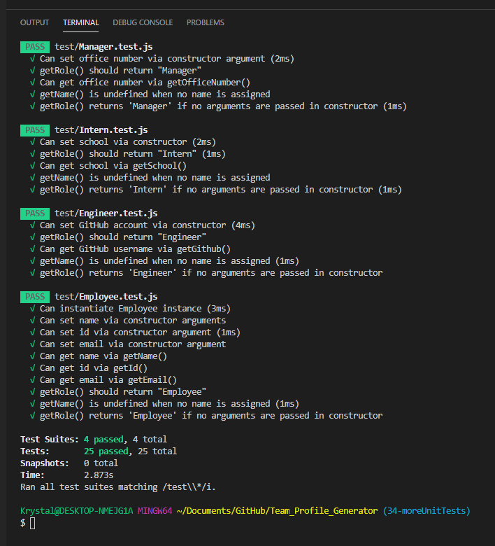

# Team Profile Generator


## Description

The goal of this assignment was to develop a team profile generator commandline interface application (CLI) that would prompt the user with questions aimed at gathering information about their business team membe. The user's input would then be used to generate a team webpage that lists all the information entered into the CLI per team member. In addition to using a commandline application to generate a team webpage, a core portion of this assignmnet was to utilize unit testing, so all code used to design the employee constructor classes was required to past all included unit tests.

## Table of Contents

Please use the links provided in the table of contents listed below to navigate through this project's ReadMe.

- [Links for Submission Items](#links-for-submission-items)
- [Assignment Scope](#assignment-scope)
- [Installation and Testing](#installation-and-testing)
- [Final Output](#final-output)

## Links for Submission Items

Here are the links to the MVP itemsthat I developed for this assignment. I will also be submitting these same items/links on Boot Camp Spot.

- Link to GitHub Repo - [https://github.com/KEDuran/Team_Profile_Generator](https://github.com/KEDuran/Team_Profile_Generator)
- Link to Demo Video for Team Profile Generator CLI application - [https://drive.google.com/file/d/1p43dYzPLJ-n4I-fFK8yLeB6pnXaDhww-/view?usp=sharing](https://drive.google.com/file/d/1p43dYzPLJ-n4I-fFK8yLeB6pnXaDhww-/view?usp=sharing)

## Assignment Scope

This assignment listed various requirement items in order to reach acceptable MVP standards. The two sections listed below list the main output and minimum requirements associated with this project.

### User Story

```
As a manager
I want to generate a webpage that displays my team's basic info
so that I have quick access to emails and GitHub profiles
```

### Minimum Requirements

The items listed below are the minimum requirements that must be met before submission for this assignment.

- Functional application.

- GitHub repository with a unique name and a README describing the project.

- User can use the CLI to generate an HTML page that displays information about their team.

- All tests must pass.

## Installation and Testing

Please reference the subsections below for installation and testing instructions required to successfully run this CLI application.

### Installation

In order to successfully develop and test for this assignment, the following items must be installed and/or accessible from you working environment (i.e. laptop, computer, etc.).

#### Make Sure to Install

- **Node.js** - Make sure this is installed in your machine. If Node.js is not installed on your machine, [click here](https://nodejs.org/en/) to download Node.js.
- **NPM Inquirer Package** - The [NPM inquirer package](https://www.npmjs.com/package/inquirer) is needed to prompt questions in the commandline.
  - This package is already listed as a dependency in the `package.json` file, so you will only need to run the `npm install` command in your terminal to access this package.
- **Jest** - The [jest](https://jestjs.io/) is the JavaScript testing framework that is used for unit testing in this project.
  - This dependency is already included in the `package.json` file, so you will only need to run the `npm install` command in your terminal to enable testing capabilities.

### Testing

When checking to see if all applicable unit tests pass throughout the development of this application, make sure to run the `npm run test` command in your terminal each time you would like to test the application.

## Final Output

To compliment the demo video provided in the [Links for Submission Items](#links-for-submission-items) section, I included the screenshots below to demonstrate that (a) all applicable unit test passed and (b) an team.html file was generated based on user input to prompted questions.

### All Unit Test Pass

Screenshot that demonstrates all unit tests pass.



### Generate Team.html file

Screenshot that shows the team.html output generated during the demo recording.


